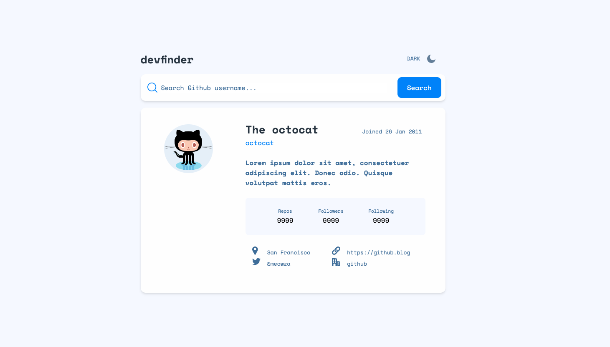
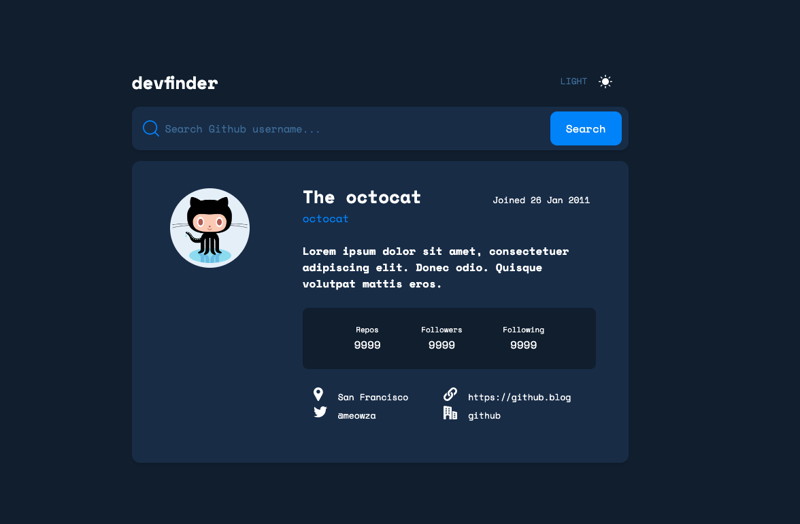
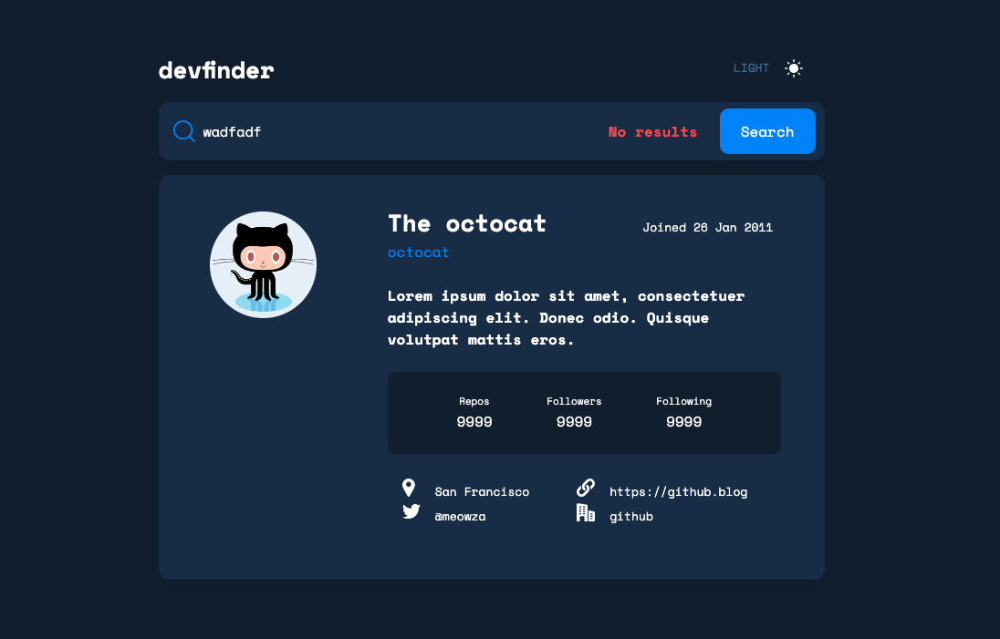
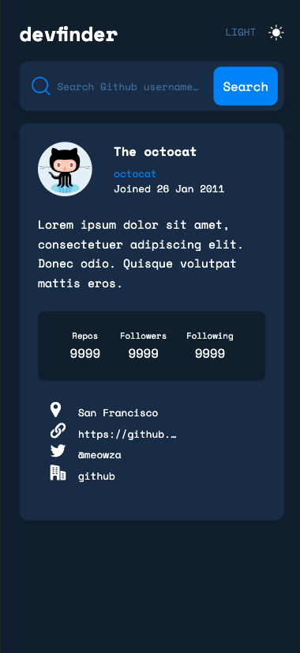
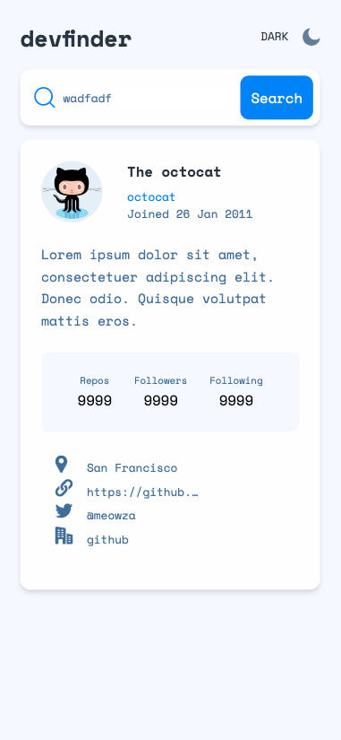

# Frontend Mentor - GitHub user search app solution

This is a solution to the [GitHub user search app challenge on Frontend Mentor](https://www.frontendmentor.io/challenges/github-user-search-app-Q09YOgaH6).

## Table of contents

- [Overview](#overview)
  - [The challenge](#the-challenge)
  - [Screenshot](#screenshot)
  - [Links](#links)
- [My process](#my-process)
  - [Built with](#built-with)
  - [What I learned](#what-i-learned)
  - [Continued development](#continued-development)
  - [Useful resources](#useful-resources)
- [Author](#author)
- [Acknowledgments](#acknowledgments)

## Overview

### The challenge

Users should be able to:

- View the optimal layout for the app depending on their device's screen size
- See hover states for all interactive elements on the page
- Search for GitHub users by their username
- See relevant user information based on their search
- Switch between light and dark themes
- **Bonus**: Have the correct color scheme chosen for them based on their computer preferences. _Hint_: Research `prefers-color-scheme` in CSS.

### Screenshot

### Links

- Solution URL: [https://github.com/R3sty/github-user-search]
- Live Site URL: [https://r3sty.github.io/github-user-search/]

## My process

First, I looked at the Figma design and started with the basic layout.
Next, I moved on to creating components and then added the necessary logic.

### Built with

- Mobile-first workflow
- [React](https://reactjs.org/) - JS library
- [Vite JS](https://vitejs.dev/) - React framework
- [TailwindCSS](https://tailwindcss.com/) - For styles

### What I learned

Throughout the development process, I learned:

It's important to start with the logic first before creating components.
How to configure a dark mode feature.
How to use React Hooks to improve the functionality of the app.
The syntax for Typescript.
How to integrate ChatGPT into my project.

### Continued development

Moving forward, I plan to continue learning and experimenting with different React Hooks to further improve my projects.

### Useful resources

- [https://tailwindcss.com/docs]- TailwindCSS's documentation provides easy to understand examples
- [https://dev.to/shashannkbawa/deploying-vite-app-to-github-pages-3ane]- This is an amazing article which helped me deploy my Vite App to Github pages

## Author

- Website - [Resty](https://www.restyiral.com)
- Frontend Mentor - [@R3sty](https://www.frontendmentor.io/profile/R3sty)
- Twitter - [@yourusername](https://twitter.com/R3XIST)

## Acknowledgments

Thank you to @DanoBroz. I referenced some of of his code when I got stuck.
